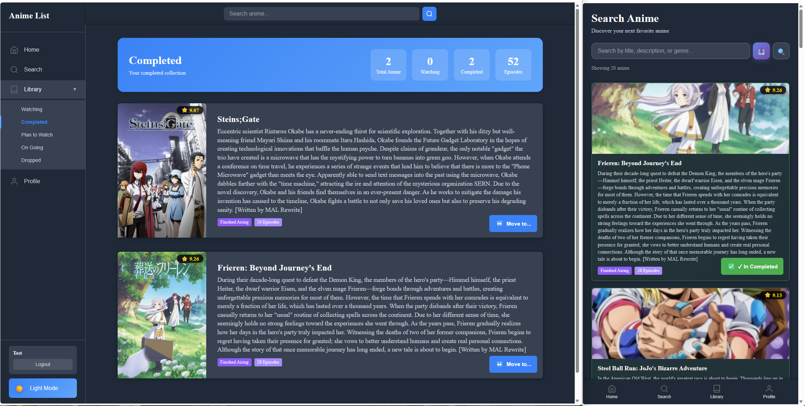

# 🚀 Frontend Application

<div align="center">
  
  <p><em>Current preview of the application interface.</em></p>
</div>

---

## 📑 Overview

This repository contains the frontend application generated using **Angular CLI version 21.2.10**. It provides a responsive, modern user interface for the application.

> ⚠️ **Important Note:** This frontend requires the **backend service** to be running locally or hosted remotely to function properly. It will not work fully out of the box without an active API connection.

---

## 🛠️ Getting Started

### Prerequisites

* **Node.js**: v20 or higher recommended
* **Angular CLI**: Version 21.2.10 (`npm install -g @angular/cli@21.2.10`)
* **Backend API**: The associated backend server up and running

### Local Setup & Environment Config

1. **Clone the repository:**
   ```bash
   git clone <repository-url>
   cd <project-folder>
   ```

2. **Install dependencies:**
   ```bash
   npm install
   ```

3. **Configure API Endpoints:**
   Ensure your API URL is correctly configured in `src/environments/environment.ts` to point to your local or remote backend:
   ```typescript
   export const environment = {
     production: false,
     apiUrl: 'http://localhost:5000/api' // Adjust port/path to match your backend
   };
   ```

4. **Start the Backend:**
   Follow the setup instructions in the backend repository to start the API server first.

5. **Run the development server:**
   ```bash
   ng serve
   ```
   Navigate to `http://localhost:4200/`. The application will automatically reload whenever you modify any of the source files.

---

## 🧰 Development Workflow

### Code Scaffolding

Angular CLI includes powerful code scaffolding tools. To generate new elements, use:

```bash
# Generate a new component
ng generate component component-name

# List all available schematics (components, directives, pipes, services, etc.)
ng generate --help
```

### Building for Production

To compile the project for production deployment:

```bash
ng build
```

This compiles your project and stores the build artifacts in the `dist/` directory. By default, the production build optimizes the application for performance and speed.

---

## 🧪 Testing

* **Unit Tests:** Execute unit tests with the [Vitest](https://vitest.dev/) test runner:
  ```bash
  ng test
  ```

* **End-to-End (E2E) Tests:** Run end-to-end testing with:
  ```bash
  ng e2e
  ```
  *(Note: Angular CLI does not come with an end-to-end testing framework by default. You can configure your preferred framework.)*

---

## 📚 Additional Resources

For more detailed command references and advanced configurations, visit the [Angular CLI Overview and Command Reference](https://angular.dev/tools/cli).